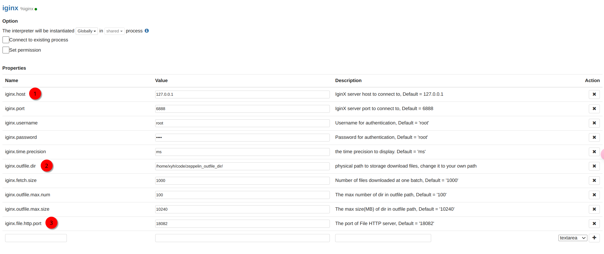

# IGinX Zeppelin-Interpreter

## 介绍

这是一个 Zeppelin 的 IGinX 解释器，用于使 Zeppelin 连接 IGinX。

## 构建Interpreter

为 Zeppelin 编译构建 IGinX 的 Interpreter

### 构建 Maven 项目

执行下面的语句以构建 IGinX Zeppelin Interpreter

```Shell
mvn clean package
```

本地构建时，建议使用参数`-Dmaven.test.skip=true`跳过本地单元测试

**注意：如果出现找不到iginx相关jar包的情况，看看本地在maven的settings.xml是否配置了镜像站，删除镜像站配置后，使用`mvn -U clean package`一般即可正确编译**

构建成功后，在 `target` 文件夹下找到 `zeppelin-iginx-VERSION-shaded.jar` 文件。

在下一步部署 Zeppelin 时我们需要用到这个包。

##### 注意事项：

1. 克隆时需要将iginx子目录同时克隆下来

```
git clone --recursive {{gitUrl}}
```

2. thrift compiler 需要加到系统环境变量中 PATH

可以通过下面的链接获取thrift compiler相应版本，此处以windows为例
https://github.com/IGinX-THU/IGinX-resources/raw/main/resources/thrift_0.16.0_win.exe

### 修改项目版本

IGinX Zeppelin Interpreter 的版本与 IGinX 版本一致，如果 IGinX 版本发生变化，需要修改 IGinX Zeppelin Interpreter 的版本。

下面的例子会将版本改为 0.7.2

```shell
mvn versions:set -DnewVersion=0.7.2
```

## 部署Zeppelin

### 方法1：直接下载并部署（推荐）

#### 下载Zeppelin包

前往 [Zeppelin 官网](https://zeppelin.apache.org/download.html)，下载 [0.8.2 网络安装版 zeppelin](https://dlcdn.apache.org/zeppelin/zeppelin-0.8.2/zeppelin-0.8.2-bin-netinst.tgz)：

这两个包的区别是 `all` 包自带了 zeppelin 所有的解释器，而 `netinst` 只带有少量解释器，因为我们使用 IGinX 自行实现的解释器，下载 `netinst` 版本即可。

下载解压后，能够得到 `zeppelin-0.8.2-bin-netinst` 文件夹，进入其中。

**注：Windows环境下，建议下载0.8.2，Zeppelin更高的版本不再支持windows运行**

#### 修改Zeppelin设置（可选）

##### 修改Zeppelin端口

Zeppelin默认占用 `8080` 端口，**一般 8080 端口常被占用，建议按照以下步骤修改 Zeppelin 端口**。

在 `conf` 文件夹下找到文件 `zeppelin-site.xml.template` ，复制一份并改名为 `zeppelin-site.xml`。

编辑文件，在文件中找到下面这段代码，将 `8080` 修改为自己想要的端口即可。

```Shell
<property>
  <name>zeppelin.server.port</name>
  <value>8080</value>
  <description>Server port.</description>
</property>
```

##### 设置JAVA路径

如果 Zeppelin 找不到 JAVA 路径，可以尝试通过以下步骤设置 JAVA 路径。

在 `conf` 文件夹下找到文件 `zeppelin-env.sh.template`，复制一份并改名为 `zeppelin-env.sh`。

编辑文件，在文件中找到下面这段代码，在 `=` 后填入本机的JAVA路径即可。

```Shell
export JAVA_HOME=
```
**在Windows环境下，建议在系统环境中配置Path及JAVA_HOME，使得java及其相关组件程序能直接被运行。**

#### 接入IGinX Zeppelin Interpreter

在 `interpreter` 文件夹下，通过复制名为“${interpreter.name}”的目录，新建一个文件夹`IGinX`，将构建好的 `zeppelin-iginx-VERSION-shaded.jar` 包放入该目录下即可。

#### 启动IGinX

接下来在启动Zeppelin前，我们需要先启动IGinX。

#### 启动Zeppelin

最后，用命令行在 `bin` 中目录下，运行命令：

```Shell
// Unix
./zeppelin-daemon.sh start

// Windows
./zeppelin.cmd
```

即可启动 Zeppelin。

### 方法2：通过 Docker部署

Zeppelin 也可以通过 docker 部署，但通过 docker 部署后，再修改配置文件、将 IGinX-Zeppelin 解释器加入都较为麻烦，因此还是推荐第一种做法。

#### 启动 IGinX

在部署 Zeppelin 之前，先启动 IGinX。

#### 接入 IGinX Zeppelin Interpreter

我们需要准备一个文件夹，用于放置 IGinX Zeppelin Interpreter。例如我们准备一个文件夹名为`zeppelin-interpreter`，其绝对路径为 `~/code/zeppelin-interpreter/`。

将 `zeppelin-iginx-VERSION-shaded.jar` 包放入我们准备好的 `zeppelin-interpreter` 文件夹内即可。

#### 使用命令启动 Docker容器

通过以下代码部署 Zeppelin

```Shell
docker run -v ~/code/zeppelin-interpreter/:/opt/zeppelin/interpreter/iginx --privileged=true --name zeppelin --network host apache/zeppelin:0.8.2
```

`-v` 参数是将宿主机的一个文件夹映射到zeppelin容器内，用于放置IGinX Zeppelin Interpreter，在上一步我们已经准备好了这个文件夹。将文件夹绝对路径替换掉红色部分即可。

`--network host` 参数是不使用端口映射，因为zeppelin还需要连接宿主机的IGinX端口，因此直接使用本地端口`8080`。

## 使用Zeppelin

使用浏览器访问 http://127.0.0.1:8080/ ，即可进入 Zeppelin。端口号根据自己的设置修改。

### 修改IGinX解释器配置

在启动 IGinX 解释器前，我们还需要先修改一下配置，在 Zeppelin 主页面右上角按照下面步骤点击打开解释器设置页面。


找到IGinX解释器的配置。



对配置进行修改，下面对配置各项进行说明，其中标红的3项需要特别注意，其他一般不需要设置。

1. **iginx.host**：IGinX 所在服务器的 IP 地址，如果 Zeppelin 与 IGinX 部署在不同机器，需要进行设置，否则不需要设置。
2. iginx.port：IGinX 占用的端口，如果没有改动则不需要设置。
3. iginx.username：IGinX 登陆账号，如果没有改动则不需要设置。
4. iginx.password：IGinX 登陆密码，如果没有改动则不需要设置。
5. iginx.time.precision：IGinX 中时间计算单位，不需要特别设置。
6. **iginx.outfile.dir**：使用 OUTFILE 语句时，Zeppelin 会将文件下载到服务器上的一个中转文件夹，再提供下载连接。此处需要在 Zeppelin 所在的服务器上创建一个中转文件夹，并填入路径。
7. iginx.fetch.size：IGinX 一次能下载的文件数量，默认为 1000，如果调大可能会减缓下载速度。
8. iginx.outfile.max.num：IGinX OUTFILE 文件夹中存放的总文件夹数量限制，每次查询会创建一个文件夹，超出后会删除最早的文件夹。
9. iginx.outfile.max.size：IGinX OUTFILE 文件夹中存储的总文件大小限制，单位为 MB，超出后会删除最早的文件。
10. **iginx.file.http.port**：IGinX 中文件下载服务要占用的端口，默认为 18082，如果需要修改端口则修改此处。
11. **iginx.zeppelin.upload.dir.max.size**：IGinX上传文件夹大小限制，单位GB，超出后会删除最早的文件。
12. **iginx.zeppelin.upload.file.max.size**：IGinX上传文件大小限制，单位GB。
13. **iginx.zeppelin.note.font.size.enable**:是否激活Note范围内统一字体尺寸，默认不开启。
14. **iginx.zeppelin.note.font.size**：Note范围内字体尺寸，默认16，可选值9-20。
15. **iginx.file.http.host**：IGinX 中文件下载服务要占用的IP，默认为 127.0.0.1。
### 新建IGinX笔记本

点击红框内的 Create new note


设置 note name，并在 Default Interpreter 中找到 iginx


点击 create 即可创建笔记本。

### 重启解释器

IGinX Zeppelin 解释器是需要连接 IGinX 的，如果我们重启了 IGinX，解释器就会断开连接，此时我们需要重启解释器。

在笔记本界面，我们点击红框内的设置按钮。再在出现的页面中，点击iginx解释器左边的刷新按钮，即可重启解释器。


### 使用IGinX语句

直接在笔记本中输入 IGinX 语句即可。


#### 特别说明
##### LOAD DATA 命令
输入LOAD DATA 命令后，需要先点击执行按钮调出文件选择控件，命令中的文件名（1处）与选择文件控件中的名称（2处，选择文件后自动填充，不可手动修改）需要保持一致。


##### SHOW COLUMNS 命令
展示可视化资产图会涉及到embedding，请前往 https://nlp.stanford.edu/projects/glove/ 下载相关模型，解压后放入 /resources/model 文件夹下，并根据模型的embedding维度修改embeddingUtils类中的EMBEDDING_DIMENSION参数。

此外，当前选用的模型只支持英文，暂不支持中文。

### 使用RESTful语句

RESTful 的 curl 语句属于 shell 语句，我们需要用到 Zeppelin 自带的 shell 解释器。

使用 shell 解释器的方法是在第一行增加 `%sh`，剩余语句在第二行输入。另外由于 Zeppelin 不支持传入文件，curl 中的 json 部分需要直接写在语句里。


### 文件下载以及图片展示

支持下载文件，并且可以展示 filesystem 中的图片

```shell
select * from table into outfile "path" as stream;（默认不展示图片，仅提供文件下载链接）
select * from table into outfile "path" as stream showimg true;（展示fs中的图片，并提供文件下载链接）
select * from table into outfile "path" as stream showimg false;（仅提供文件下载链接）
```
